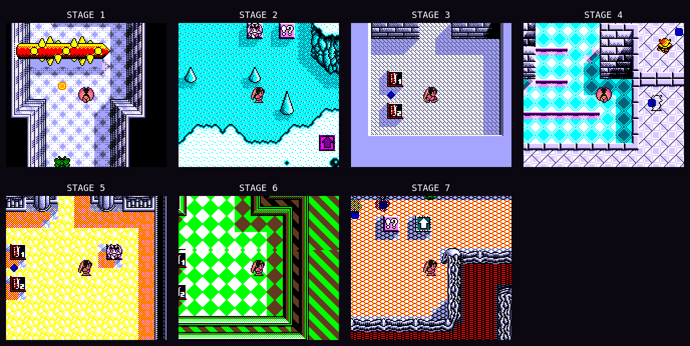
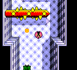
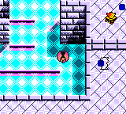
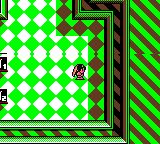
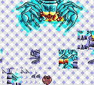
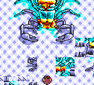
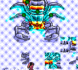
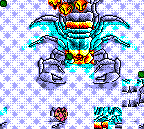
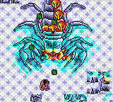

# Penta Dragon DX

An in-progress Game Boy Color conversion of *Penta Dragon* (Japan).

Penta Dragon DX adds scene-aware color to the original game while preserving
its movement, music, maps, cutscenes, title demo, and boss fights. The project
is approaching its first public release; the remaining work is mostly visual
palette tuning with a live audience.

[](artifacts/stage-collage/index.html)

## Current status

**v3.01 stream RC9 — playable, palette vote pending.**

- Title footer: `DX V3.01 STRUK LABS`
- Deterministic verification: **53/53 passed**
- Candidate MD5: `e8baabaaa6b5d5073dba12985e8cfe00`
- Stage 1, pickups, rotating hazards, title reel, bosses, and story scenes are
  colorized.
- Audience palette selection and the reservation-backed MiSTer pass are still
  required before release.

The ROM is intentionally not stored in this repository.

## Gameplay

<table>
  <tr>
    <td align="center"><br><sub>Stage 1 — rotating hazard and pickups</sub></td>
    <td align="center"><br><sub>Stage 4 — cyan floor and stonework</sub></td>
    <td align="center"><br><sub>Stage 6 — green chamber</sub></td>
  </tr>
</table>

The [full stage gallery](artifacts/stage-collage/index.html) shows all seven
stages and the Stage 4/6 palette comparisons.

## Shalamar clips

Shalamar is the current boss-palette tuning target. These five live captures
show the newer cyan/teal palette candidate (`61b4f8c…`), which has not been
promoted over RC9. The remaining gray fragments and color placement are still
under review.

<table>
  <tr>
    <td align="center"><br><sub>Idle fire</sub></td>
    <td align="center"><br><sub>Horizontal movement</sub></td>
    <td align="center"><br><sub>Vertical movement</sub></td>
  </tr>
  <tr>
    <td align="center"><br><sub>Orbit pattern</sub></td>
    <td align="center"><br><sub>Strafing</sub></td>
    <td></td>
  </tr>
</table>

## What is colorized

- Seven dungeon stages with distinct material palettes
- Sara Witch, Sara Dragon, enemies, projectiles, and pickups
- Rotating and thrusting spike hazards
- The 38-character title-screen spotlight reel
- Nine boss arenas and the miniboss roster
- Opening, pre-final, ending, credits, and epilogue scenes
- Title screen, stage cards, menus, HUD, death screen, and GAME OVER

Colors are defined in YAML rather than buried in hand-edited ROM bytes. The
main files are:

- `palettes/penta_palettes_v097.yaml` — actual CGB colors
- `palettes/monster_palette_map.yaml` — monster families
- `palettes/bg_tile_categories.yaml` — floors, hazards, pickups, and materials

## Build and play

You need your own supported Japanese ROM at `rom/Penta Dragon (J).gb`.
Its MD5 must be `df43e0adfdc74b2829c7e95e91c71a28`.

```bash
python3 scripts/build_v302_title_fix.py
scripts/launch_mgba.sh rom/working/penta_dragon_dx_FIXED.gb
```

The launcher is deliberate: it prevents multiple mGBA processes from piling
up and uses the working display configuration for headed testing.

## Tune palettes live

```bash
scripts/palette_session.sh start
```

This opens the guarded mGBA session and browser color picker. Its scene deck
jumps between stages, bosses, characters, and story art so colors can be
compared quickly during a stream.

Live changes are emulator-side CRAM overrides: they are allowed to use mGBA
states and palette-RAM writes, and they do not add a palette editor or teleport
to the release ROM. **Save to YAML** records an approved choice; rebuilding the
ROM is the independent proof that the same colors persist in the shipped patch.

```bash
scripts/palette_session.sh status
scripts/palette_session.sh stop
```

See the [livestream runbook](docs/stream_runbook.md) for the audience-vote
order and post-stream release steps.

## Verification

The release suite builds the ROM twice, requires byte-identical output, and
runs every emulator gate serially:

```bash
python3 scripts/diagnostics/run_deterministic_suite.py
```

The current candidate passes **53/53** gates, including cold game start,
Stage 1 terrain and pickups, later-stage soak tests, low-health flicker,
title-demo actors, all bosses, and all story scenes.

- [Latest hash-bound receipt](docs/release/verification/latest.json)
- [Release and packaging rules](docs/release/README.md)
- [Technical documentation index](docs/INDEX.md)
- [Changelog](CHANGELOG.md)

## Distribution

This repository contains source code, palette data, verification tools, and a
ROM-free IPS patch. It does not contain the original or modified game ROM,
save files, or emulator states.

*Penta Dragon* is owned by its original rights holders. Penta Dragon DX is an
unofficial fan project.
