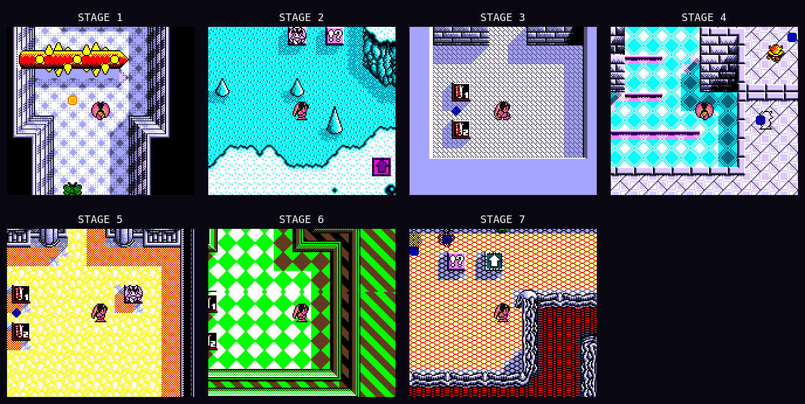
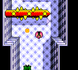
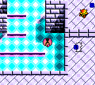
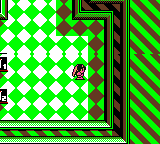
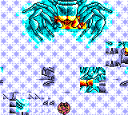
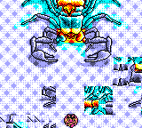
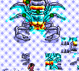
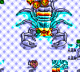
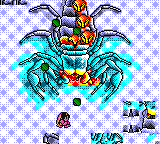

# Penta Dragon DX

## MiSTer browser palette lab (experimental)

Edit colors on Blackmage while playing on Rivalmage: **Apply & Resume** saves
a checkpoint, uploads a palette-only candidate, reloads GBC, and restores the
state. **Undo & Resume** returns to the previous ROM/checkpoint. The browser
uses descriptive labels and explains shared palettes—for example, **BG5:
Rotating spike bodies & power pickups** (not the protruding teeth).

Run `python3 scripts/mister_palette_bridge.py`, then open
<http://127.0.0.1:8078>. This first version requires the pinned r536 ROM,
reserves savestate slot 4, and supports primary palettes only. Generated
ROMs/states stay out of Git; release ROMs and YAML are not overwritten.
See [setup, limitations, and hardware evidence](docs/mister_palette_lab.md).

This is a tooling milestone, **not a game-release readiness claim**.
The Game Over/title/new-game repair passes emulator regression; its final
hardware replay is still pending.

An in-progress Game Boy Color conversion of *Penta Dragon* (Japan).

Penta Dragon DX adds scene-aware color to the original game while preserving
its movement, music, maps, cutscenes, title demo, and boss fights. The project
is approaching its first public release; exact-candidate sign-off, Ted's
documented presentation decision, audience palette review, and hardware
testing remain.

[](artifacts/stage-collage/index.html)

## Current status

October 6 playtest repairs passed the full source-bound emulator suite on
October 7: **97/97 checks and two byte-identical builds**. Human retest candidate SHA-256:
`6c4a9654b5c6dad70c8ea21bfd39b6e53766a3cd1a642153c6085774392ec228`.
Changes address corrupt stage-header data, stale score-card sprites/attributes,
shared enemy/player projectile palettes, and inherited graphics state at boss
entry. This candidate is **ready for human retesting, not a final release or
hardware sign-off**. The [verification receipt](docs/release/verification/latest.json)
binds the exact candidate, source, and retained emulator evidence.
The recorded Stage 2 screen-fixed lake artifact still needs direct confirmation.
See the [investigation and test scope](docs/audit/playtest_20261006.md) and
[continuous retest route](docs/audit/oct06_retest_route.md).

Build this candidate with
`python3 scripts/diagnostics/build_stream_source_candidate.py --out-dir tmp/playtest-build`;
run its complete serial emulator suite with
`python3 scripts/diagnostics/run_deterministic_suite.py --stream-source`.
Use fresh output directories and the project's configured emulator runtime.
Older results below do not qualify this newer candidate.

### Previously qualified restart baseline

**v3.01 restart-fix candidate — 90/90 emulator checks passed;
final human/Ted-presentation, audience-palette, and hardware sign-off pending.**

- Title footer: `DX V3.01 STRUK LABS`
- Historical restart candidate: SHA-256
  `c693eafb50e7872fa884d0d26ce3fbfd4f2fac0dba246ff738931643e7f0ba5d`.
- The 2026-09-16 publication run passed all **90 integration gates** and
  produced two byte-identical original-cartridge builds. The full unit sweep
  passed **1,195 tests**. These are historical baseline results; the latest
  checked-in verification receipt now covers the October playtest candidate above.
- Issues #7–#10: repaired Game Over attribute cleanup, title color reinitialization,
  both Stage 01 cards, and restarted gameplay. Three restart routes run two
  death/restart cycles each, including blank-SRAM and saved-game paths. The
  spike tests walk into hazards and then force HP to zero to make death timing
  deterministic; they are not movement-only collision proofs.
- Build the repaired candidate from the original cartridge with
  `python3 scripts/build_restart_candidate.py --out-dir tmp/restart-build`.
  Qualify two fresh builds with
  `python3 scripts/diagnostics/run_deterministic_suite.py --restart-source`.
  Output directories must be fresh. Use the project's configured mGBA runtime.
  See [restart investigation and evidence](docs/audit/gameover_restart_investigation.md).
- In headed mGBA play of the previous r535 preview on 2026-09-10, the tester
  reported that the red/green
  bleed after closing the item menu appeared fixed and confirmed that the
  title screen keeps its color. Initial-loading behavior still needs human
  confirmation. That reviewed ROM's SHA-256 was
  `fe14b0e3c392b3d822208684636e1017cb093613d28e6ca477999535df164576`.
- Focused automated checks passed for stationary menu closure, title color,
  stage-card stability, attract-to-game start, and opening-to-Stage-1 handoff.
- Stage 1, pickups, rotating hazards, title reel, bosses, and story scenes are
  colorized.
- An r536 diagnostic repair fixes a final-boss VRAM read made during pixel
  transfer. All nine boss geometry contracts pass with freshly generated
  states, and final-boss publication cadence passes the unchanged phase bound
  (1.1810 versus a 1.20 ceiling). The tighter speed target is still missed.
  A supplemental 3,600-frame final-boss replay has zero palette mismatches.
- The parent r536 candidate passed all **87 checks in a fresh, source-bound
  deterministic emulator suite**, all **49 r535/r536 unit tests**, and an
  expanded **199-test release/provenance contract sweep**. Two fresh
  original-cartridge source rebuilds produce byte-identical ROMs.
- A headed playtest of exact r536 was reported as “silky smooth.” Explicit
  confirmation of the title/loading/menu-close checklist remains pending; an
  informal play session is not relabeled as a complete playtest receipt.
- Ted's stabilized whip/orb presentation still requires the documented
  operator decision against the hash-pinned side-by-side clip in
  [known deviations](docs/release/known_deviations.md).
- Audience palette selection and the reservation-backed MiSTer pass are still
  required before release.

The ROM is intentionally not stored in this repository.

## Gameplay

<table>
  <tr>
    <td align="center"><br><sub>Stage 1 — rotating hazard and pickups</sub></td>
    <td align="center"><br><sub>Stage 4 — cyan floor and stonework</sub></td>
    <td align="center"><br><sub>Stage 6 — green chamber</sub></td>
  </tr>
</table>

The [full stage gallery](artifacts/stage-collage/index.html) shows all seven
stages and the Stage 4/6 palette comparisons.

## Shalamar animation reference

These five reference captures show Shalamar's major animation poses. They are
historical examples, not qualification evidence for the current preview;
exact color choices remain adjustable during the palette stream.

<table>
  <tr>
    <td align="center"><br><sub>Idle fire</sub></td>
    <td align="center"><br><sub>Horizontal movement</sub></td>
    <td align="center"><br><sub>Vertical movement</sub></td>
  </tr>
  <tr>
    <td align="center"><br><sub>Orbit pattern</sub></td>
    <td align="center"><br><sub>Strafing</sub></td>
    <td></td>
  </tr>
</table>

## What is colorized

- Seven dungeon stages with distinct material palettes
- Sara Witch, Sara Dragon, enemies, projectiles, and pickups
- Rotating and thrusting spike hazards
- The 38-character title-screen spotlight reel
- Nine boss arenas and the miniboss roster
- Opening, pre-final, ending, credits, and epilogue scenes
- Title screen, stage cards, menus, HUD, death screen, and GAME OVER

Colors are defined in YAML rather than buried in hand-edited ROM bytes. The
main files are:

- `palettes/penta_palettes_v097.yaml` — actual CGB colors
- `palettes/monster_palette_map.yaml` — monster families
- `palettes/bg_tile_categories.yaml` — floors, hazards, pickups, and materials

## Build and play

You need your own supported Japanese ROM at `rom/Penta Dragon (J).gb`.
Its MD5 must be `df43e0adfdc74b2829c7e95e91c71a28`.

The pinned r536 release candidate is built directly from the supported
original cartridge by `scripts/build_r536_candidate.py`. It is not the output
of the legacy `build_v302_title_fix.py` command. Its construction and test
history are documented in the
[repair audit](docs/audit/stage4_cache_key_r534.md).

For a local checkout with the exact pinned candidate already built:

```bash
scripts/launch_mgba.sh tmp/r536-penta-seam-vram-current636/candidate.gb
```

The launcher is deliberate: it prevents multiple mGBA processes from piling
up, requires an explicit ROM, records its SHA-256, and uses the working display
configuration for headed testing. A successful launch is not a passing
playtest receipt.

## Tune palettes live

```bash
scripts/palette_session.sh start
```

This opens the guarded mGBA session and browser color picker. Its scene deck
jumps between stages, bosses, characters, and story art so colors can be
compared quickly during a stream.

Live changes are emulator-side CRAM overrides: they are allowed to use mGBA
states and palette-RAM writes, and they do not add a palette editor or teleport
to the release ROM. **Save to YAML** records an approved choice; rebuilding the
ROM is the independent proof that the same colors persist in the shipped patch.

```bash
scripts/palette_session.sh status
scripts/palette_session.sh stop
```

See the [livestream runbook](docs/stream_runbook.md) for the audience-vote
order and post-stream release steps.

## Verification

The release suite builds the ROM twice, requires byte-identical output, and
runs every emulator gate serially:

```bash
LD_LIBRARY_PATH="$PWD/tmp/mgba-cgb-latches-r454/build" \
TMPDIR="$PWD/tmp" PYTHONDONTWRITEBYTECODE=1 \
python3 scripts/diagnostics/run_deterministic_suite.py \
  --r536-source --output tmp/r536-deterministic-FRESH-ATTEMPT
```

The r536 source profile's fresh 87-gate emulator regression run completed on
2026-09-14 with **87 passed, zero failed, zero blocked**. The source
fingerprint, two independent source builds, distribution IPS, and exact
tested-ROM hash stayed bound throughout the run.
All nine boss geometry contracts, publication cadence, title/menu, stage,
ending, and live-palette checks pass. All 49 r535/r536 unit tests and the
expanded 199-test release/provenance contract sweep pass too.

Earlier failed manifests remain unchanged: r535 recorded 77 passed, 3 failed,
and 7 blocked; the first r536 run recorded 86 passed and one outdated static
expectation. The final run was fresh after correcting that verifier to check
the replacement seam implementation exactly, with mutation controls.

The exact-candidate checklist, Ted presentation ratification, audience palette
selection, and reservation-backed MiSTer sweep remain required. The emulator
pass is not a complete release pass. See the
[repair audit](docs/audit/stage4_cache_key_r534.md) for exact artifacts and
negative controls.

- [Published deterministic-suite receipt](docs/release/verification/latest.json)
- [Release and packaging rules](docs/release/README.md)
- [Technical documentation index](docs/INDEX.md)
- [Changelog](CHANGELOG.md)

## Distribution

This repository contains source code, palette data, verification tools, and a
ROM-free IPS patch. It does not contain the original or modified game ROM,
save files, or emulator states.

The checked-in IPS reconstructs exact r536. Apply
`rom/penta_dragon_dx.ips` to a clean Japanese *Penta Dragon* ROM whose MD5 is
`df43e0adfdc74b2829c7e95e91c71a28`. The patched 512 KiB ROM must have MD5
`d178b431bdbca10d6bd739e91e0535f6` and SHA-256
`b93ebc46ed4ac23ec7d2c44d80fae1ae1538b38c038bab0ba8173b93fe252350`.
It can then be played in a Game Boy Color emulator such as mGBA or copied to
`Assets/gbc/common/` on an Analogue Pocket SD card.

*Penta Dragon* is owned by its original rights holders. Penta Dragon DX is an
unofficial fan project.
