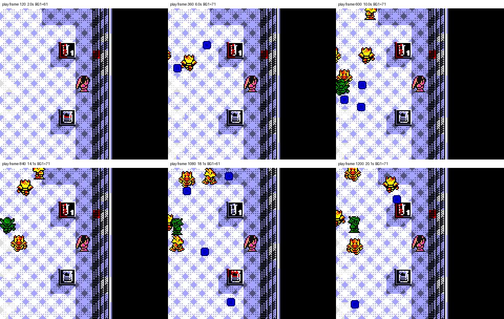
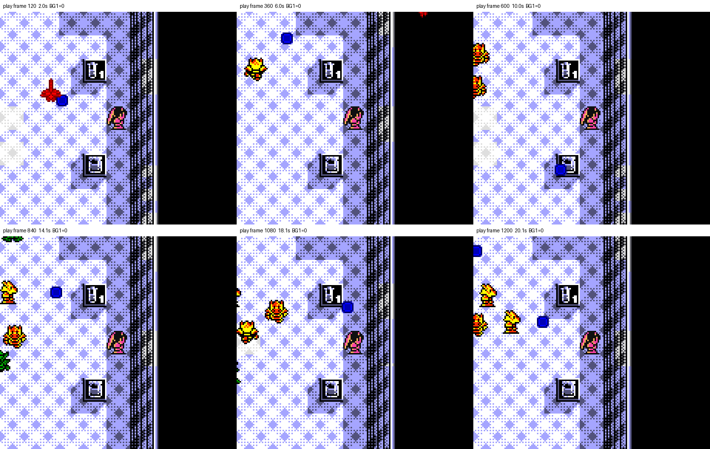

# Stage 1 no-color-bleed receipt

The defect was a whole-tile palette mistake. Stage 1 pickup art is made from
BG tiles that contain both pickup pixels and surrounding floor/wall pixels.
Mapping those tile IDs to red BG1 recolored the shared background pixels too.

The old ROM `67cf1235…` mapped 111 Stage 1 tile IDs to BG1. During the same
1,206-frame cold-boot gameplay route it produced 76,411 visible BG1 cells;
the six checkpoints contained 61–71 red cells each.

The fixed ROM `c0a29419…` maps the Stage 1 table only to neutral floor BG0 and
slate-wall BG6. The verifier sampled every visible cell on all 1,206 gameplay
frames: 434,808 checks, zero BG1 cells, zero unexpected palettes, zero
bank/flip/priority leakage, and 15 live scroll changes. Enemy and Sara colors
remain OBJ palettes and are not background bleed.

## Actual-play comparison

The user’s headed captures are
[`user-headed-04.png`](before-67cf1235/user-headed-04.png) and
[`user-headed-14.png`](before-67cf1235/user-headed-14.png). The fixed targeted
pickup-state render is
[`pickup-targeted.png`](after-c0a29419/pickup-targeted.png).

Machine-readable details and SHA-256 hashes are in each run’s `receipt.json`;
all twelve native `160×144` screenshots are retained beside them. No ROM,
save, or savestate is included.
